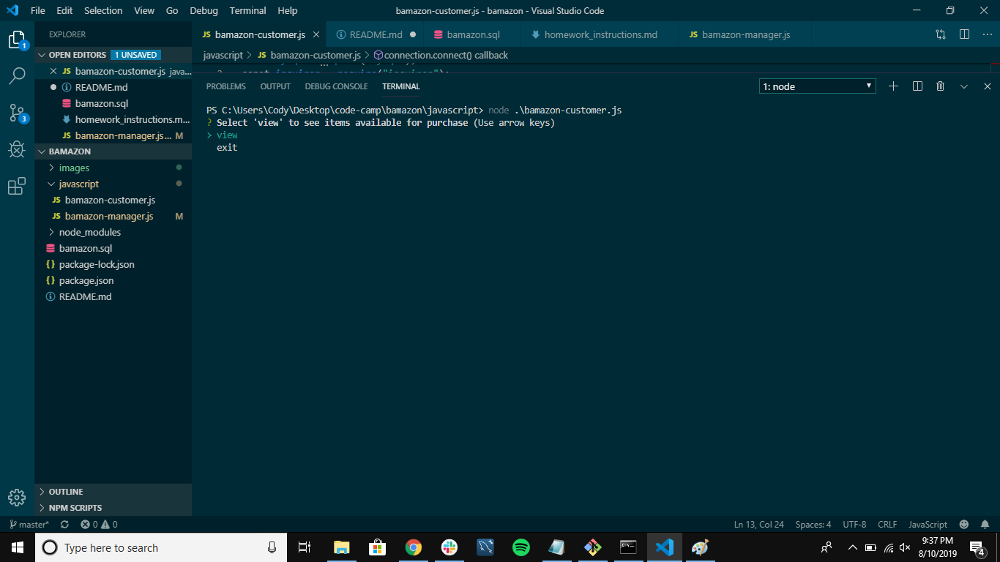
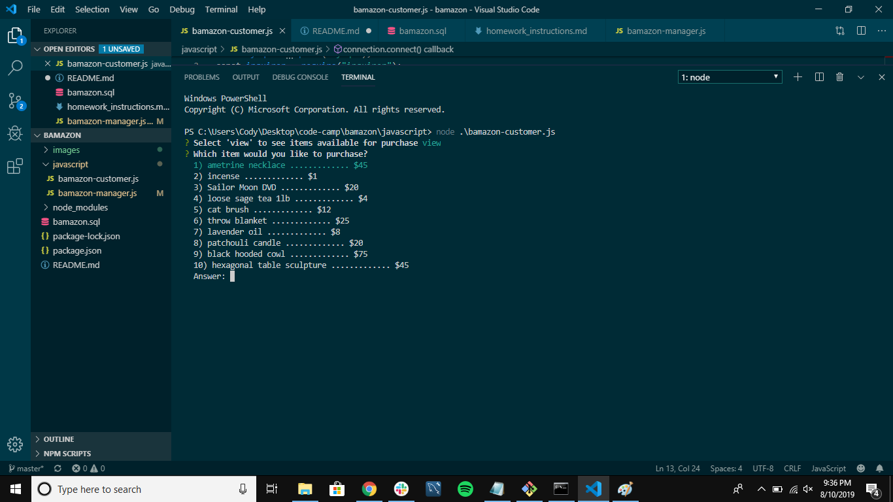
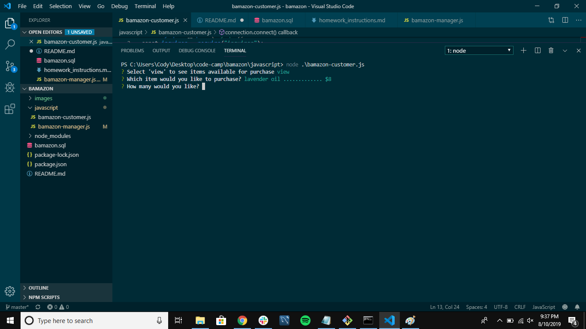
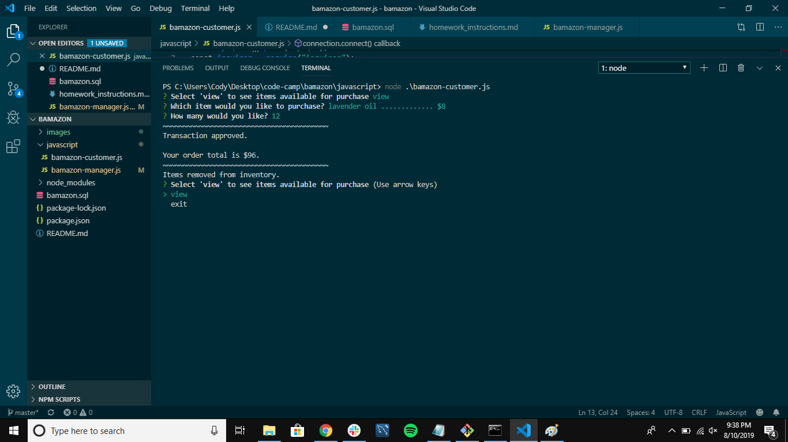
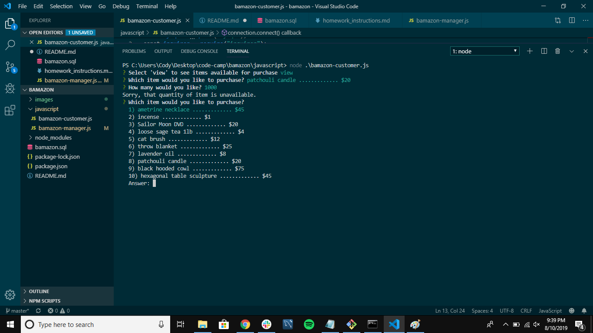

# bamazon

Hello! Here is a guide to Bamazon. I have completed two of the three levels for the homework.

Bamazon customer (level one)- 

step one: the two options at the beginning: 

step two: displaying all the items in the database. You're able to scroll through and select what you wish to purchase: 

step three: selecting an item. You will be prompted to select how much of that item you wish to purchase: 

step four: completion: if you enter a valid number (i.e. the database hold enough stock), your transaction is completed: 

failure: if you enter an invaled number (the database does NOT hold enough stock), your transaction fails: 

bamazon manager (level two)- 
 
step one: options listed: 

option one: displays items available for purchase: 

option two: displays options low on stock: 

option three (add inventory): 
    1)add stock to an items that already exists: 
    

    2)enter the amount of stock you wish to add:
    

    3)inventory has been updated:
    

option four (add new item entirely): 
    1)asks the name of the item:
    
    
    2)asks the category for the item, provides scrollable list:
    

    3)asks the price of the item
    

    4)asks the stocked quantity of the item
    

    5)adds the new item to the database, displays the table of available items (with newly created data)
    

And that's all! Here's a link to the repo: https://tuocha.github.io/bamazon/